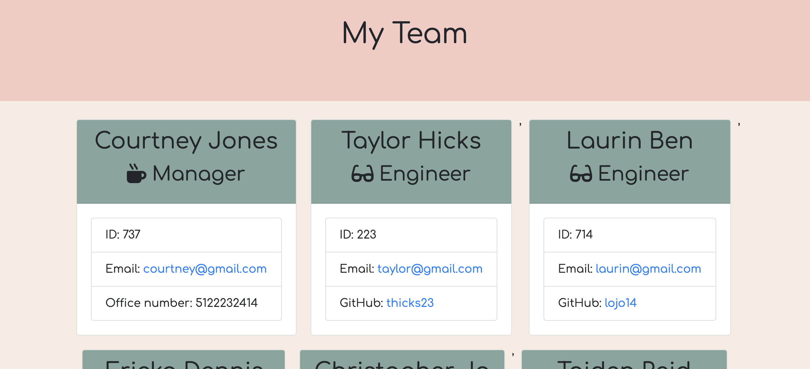

# Template Engine - Employee Summary

## Description


This is application uses the CLI to generate an up to date HTML with all current employees on an Engineering team (managers, engineers, & interns). The user is able to collect all emplyees important information ie. name, Id, email, role, and role specific info and add this information to a an HTML document creating a summary card for each employee. 


## User Story

```
As a manager
I want to generate a webpage that displays my team's basic info
so that I have quick access to emails and GitHub profiles
```

## Image of Roster



